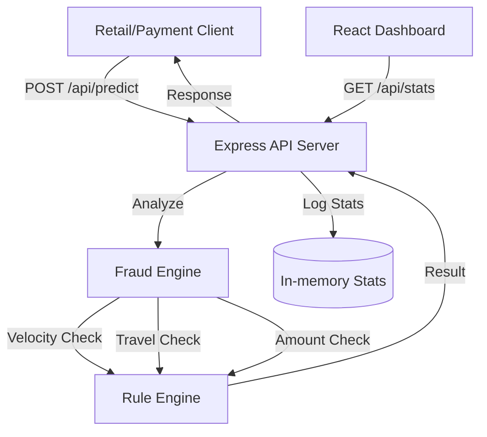

# SafeGuard AI - Smart Payment Fraud Detection API

SafeGuard AI is a production-ready, real-time fraud detection system. It uses a high-performance heuristic and rule-based engine (scalable to ML models) to evaluate transaction risks in under 100ms.

## Architecture



## Features

- **Real-time Scoring**: Instant probability score and risk level (Low, Medium, High).
- **Rule-based Logic**:
  - **Velocity Analysis**: Detects rapid transactions from a single user.
  - **Impossible Travel**: Calculates GPS distance vs time since last txn.
  - **Magnitude Check**: Flags amounts deviating significantly from user averages.
- **Monitoring Dashboard**: Live charts and analysis feed built with React & Recharts.
- **Simulation Toolkit**: One-click transaction generator to test edge cases.

## API Usage

### 1. Predict Fraud Risk
**Endpoint**: `POST /api/predict`

**Payload**:
```json
{
  "id": "txn_8829",
  "userId": "user_22",
  "amount": 1250.00,
  "currency": "USD",
  "timestamp": "2024-04-21T10:00:00Z",
  "location": {
    "lat": 40.7128,
    "lng": -74.0060,
    "city": "New York",
    "country": "USA"
  },
  "deviceId": "iphone_15_pro",
  "merchantId": "amazon_inc"
}
```

**Response**:
```json
{
  "transactionId": "txn_8829",
  "probability": 0.45,
  "riskLevel": "medium",
  "reasons": ["Transaction amount is significantly higher (>10x) than user average"],
  "timestamp": "2024-04-21T10:00:01Z"
}
```

### 2. Get Engine Statistics
**Endpoint**: `GET /api/stats`

## Setup & Running locally

1. **Install Dependencies**:
   ```bash
   npm install
   ```
2. **Start Dev Server**:
   ```bash
   npm run dev
   ```
3. **Build for Production**:
   ```bash
   npm run build
   ```

## Future Roadmap
- [ ] Integration with XGBoost/TensorFlow via Python microservice (currently heuristic).
- [ ] Redis caching for ultra-low latency history lookups.
- [ ] Per-merchant risk weighting.


  # 🚀 Sentinel AI — Real-Time Fraud Detection System

<p align="center">
  
</p>

<p align="center">
  <b>Production-grade fintech fraud detection platform with real-time streaming, ML-based scoring, and event-driven architecture.</b>
</p>

---

## ⚡ System Overview (3D Architecture)


<p align="center">
  
</p>

```
        ┌──────────────┐
        │   Client UI  │
        └──────┬───────┘
               │ WebSocket (Live Stream)
               ▼
        ┌──────────────┐
        │  API Layer   │  ← Fast Response (202 Accepted)
        └──────┬───────┘
               │
               ▼
        ┌──────────────┐
        │ Redis Queue  │  ← Async Processing
        └──────┬───────┘
               │
               ▼
        ┌──────────────┐
        │ Worker Engine│
        │ (Fraud ML)   │
        └──────┬───────┘
               │
               ▼
        ┌──────────────┐
        │ PostgreSQL DB│
        └──────────────┘
```

---

## 🧠 Key Features

### 🔥 Real-Time Fraud Detection

* WebSocket-based live prediction stream
* Instant fraud alerts with risk classification

### ⚙️ Event-Driven Architecture

* Redis (BullMQ) queue for async processing
* Worker-based scalable design

### 🤖 ML-Based Risk Scoring

* Logistic regression-inspired scoring
* Hybrid model (ML + rule-based boosters)

### 📊 Explainable AI

* Feature importance visualization
* “Why flagged?” insights for every transaction

### 🐳 Production Ready

* Dockerized services
* Modular clean architecture
* Type-safe full-stack system

---

## 🛠️ Tech Stack

| Layer      | Technology                   |
| ---------- | ---------------------------- |
| Backend    | Node.js, Express, TypeScript |
| Frontend   | React, Tailwind, Recharts    |
| Queue      | Redis (BullMQ)               |
| Database   | PostgreSQL                   |
| Realtime   | WebSockets                   |
| Deployment | Docker                       |

---

## 📡 API Endpoints

### 🔹 Predict Transaction

```bash
POST /api/predict
```

**Request**

```json
{
  "user_id": "U123",
  "amount": 15000,
  "location": "Delhi",
  "device_id": "D001"
}
```

**Response**

```json
{
  "status": "accepted",
  "message": "Processing asynchronously"
}
```

---

## 📊 Live Dashboard

* 📈 Fraud Intensity Index
* ⚠️ Risk Alerts Feed
* 📉 Feature Importance Charts
* 🔁 Real-Time Streaming

---

## 🐳 Run Locally (Docker)

```bash
docker-compose up --build
```

---

## 🧪 Project Highlights

* ⚡ <10ms fraud inference engine
* 🔄 Async queue-based processing
* 🌍 Designed for fintech-scale systems
* 📦 Microservice-ready architecture

---

## 🎯 Why This Project?

This project simulates a **real-world fintech fraud detection pipeline**, demonstrating:

* System design thinking
* Real-time data processing
* ML + backend integration
* Production-grade architecture

---

## 👨‍💻 Author

**Jiten Moni Das**
🔗 LinkedIn: https://www.linkedin.com/in/jiten-moni-das-01b3a032b
💻 GitHub: https://github.com/jiten54

---

<p align="center">
  
</p>
