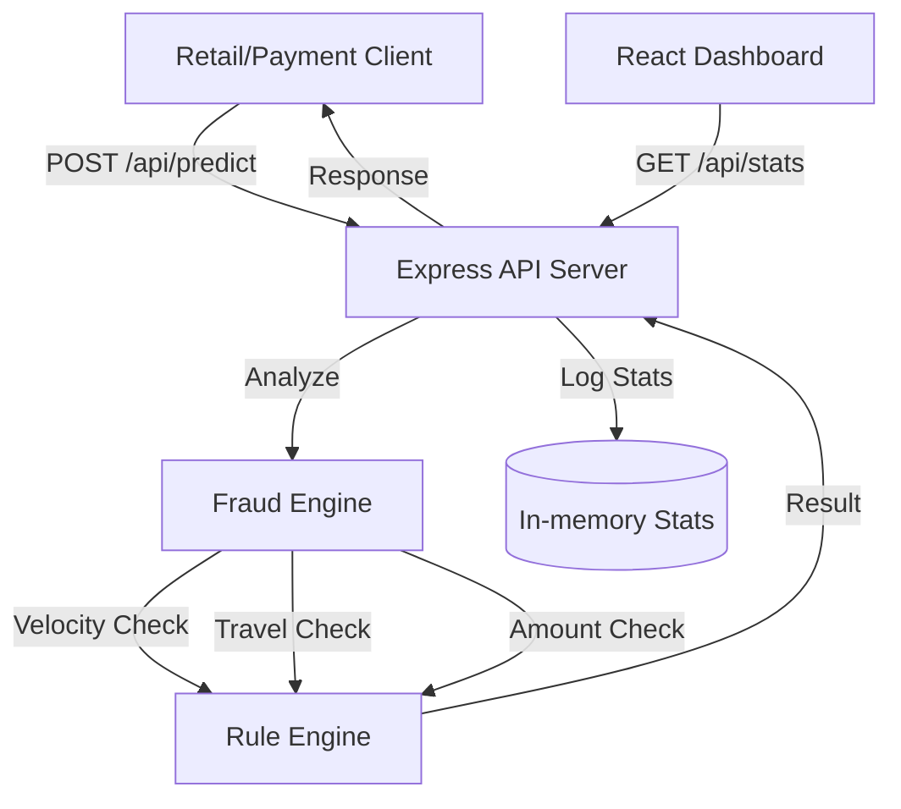

# SafeGuard AI - Smart Payment Fraud Detection API

SafeGuard AI is a production-ready, real-time fraud detection system. It uses a high-performance heuristic and rule-based engine (scalable to ML models) to evaluate transaction risks in under 100ms.

## Architecture



## Features

- **Real-time Scoring**: Instant probability score and risk level (Low, Medium, High).
- **Rule-based Logic**:
  - **Velocity Analysis**: Detects rapid transactions from a single user.
  - **Impossible Travel**: Calculates GPS distance vs time since last txn.
  - **Magnitude Check**: Flags amounts deviating significantly from user averages.
- **Monitoring Dashboard**: Live charts and analysis feed built with React & Recharts.
- **Simulation Toolkit**: One-click transaction generator to test edge cases.

## API Usage

### 1. Predict Fraud Risk
**Endpoint**: `POST /api/predict`

**Payload**:
```json
{
  "id": "txn_8829",
  "userId": "user_22",
  "amount": 1250.00,
  "currency": "USD",
  "timestamp": "2024-04-21T10:00:00Z",
  "location": {
    "lat": 40.7128,
    "lng": -74.0060,
    "city": "New York",
    "country": "USA"
  },
  "deviceId": "iphone_15_pro",
  "merchantId": "amazon_inc"
}
```

**Response**:
```json
{
  "transactionId": "txn_8829",
  "probability": 0.45,
  "riskLevel": "medium",
  "reasons": ["Transaction amount is significantly higher (>10x) than user average"],
  "timestamp": "2024-04-21T10:00:01Z"
}
```

### 2. Get Engine Statistics
**Endpoint**: `GET /api/stats`

## Setup & Running locally

1. **Install Dependencies**:
   ```bash
   npm install
   ```
2. **Start Dev Server**:
   ```bash
   npm run dev
   ```
3. **Build for Production**:
   ```bash
   npm run build
   ```

## Future Roadmap
- [ ] Integration with XGBoost/TensorFlow via Python microservice (currently heuristic).
- [ ] Redis caching for ultra-low latency history lookups.
- [ ] Per-merchant risk weighting.
